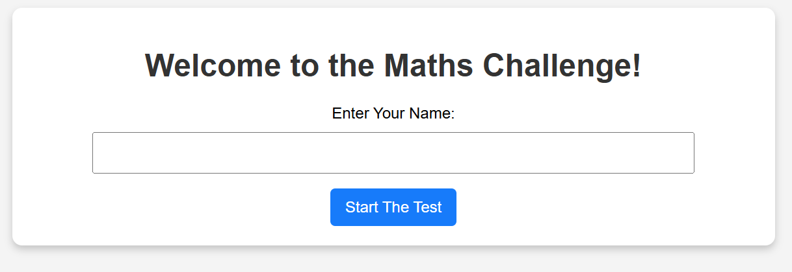
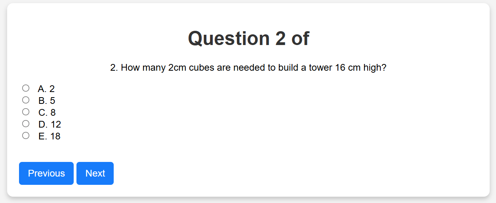
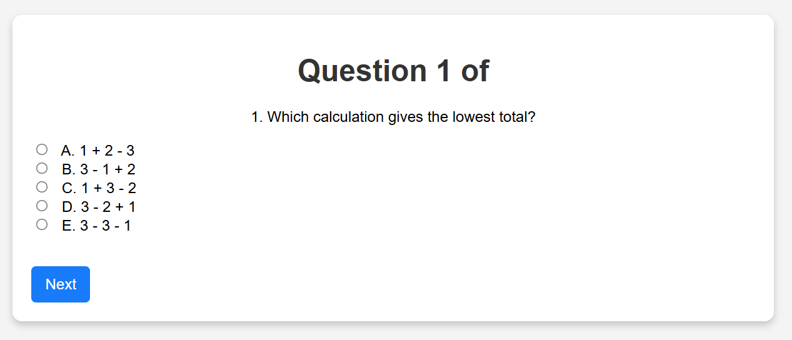
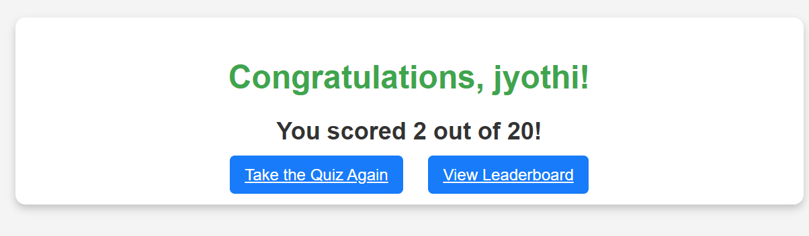
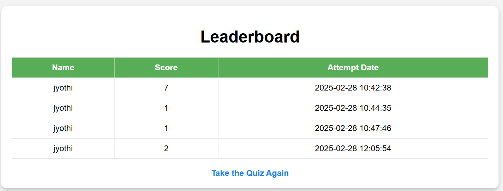

🧮 Mathematics Quiz Challenge – A Web-Based Interactive Quiz Application

📌 About the Project

The Mathematics Quiz Challenge is a web-based quiz application designed to test and enhance users’ mathematical problem-solving skills in a fun and engaging way. Built using Flask and PostgreSQL, this interactive quiz allows users to attempt a set of dynamically generated questions while tracking their progress and performance.

Key features include:
✅ User-Based Quiz Attempts – Users enter their names before starting, and their scores are recorded for each attempt.
✅ Smart Question Selection – The quiz dynamically selects and modifies questions for repeat attempts, ensuring variety.
✅ Web-Based Interface – Questions are displayed in a structured format, with support for images.
✅ Time-Based Quiz – A timer ensures users complete the quiz within a set duration.
✅ Leaderboard System – Scores are stored and displayed in a leaderboard for motivation and competition.
✅ Local Database Storage – User details, quiz attempts, and scores are stored securely in PostgreSQL.

The Mathematics Quiz Challenge is an ideal platform for students and learners to practice and refine their problem-solving skills while keeping track of their progress over time.

🚀 Features

🎯 20 Fixed Questions: Questions appear in a structured order based on difficulty.

🔄 Previous & Next Navigation: Users can move between questions while saving responses.

✅ Submit Button: A final submission option is provided at the end of the quiz.

🏆 Leaderboard & Score Tracking: Scores are saved after each attempt, allowing users to compare progress over multiple sessions.

📄 Web-Based Interface: Fully responsive and user-friendly design.

🕰 Timed Quiz (Upcoming): Future enhancements will include time-based assessments.

🖼 Image-Based Questions (Upcoming): Support for graphical problems.

🛠️ Installation & Setup

1️⃣ Prerequisites

Ensure you have the following installed:

Python 3.x

Flask (pip install flask)

PostgreSQL (using a database for storing results)

2️⃣ Clone the Repository

git clone https://github.com/jyothimalla/MathematicsChallenges.git
cd MathematicsChallenges

3️⃣ Install Dependencies

pip install -r requirements.txt

4️⃣ Run the Flask Server

python app.py

The server will start on http://127.0.0.1:5000

5️⃣ Deploying Online

Use Render for hosting both Flask and PostgreSQL databases.

Alternatively, use Heroku or Railway.app.

🖥️ Usage

1️⃣ Enter your name and start the quiz.
2️⃣ Answer each question, navigating between previous and next.
3️⃣ Submit your test to see your score and track attempts on the leaderboard.
4️⃣ View the leaderboard to compare with previous attempts.

📸 Screenshots

## 📸 Screenshots

### Home Page

### Quiz Interface

### Results

### Leaderboard

📅 Future Improvements

Implement time-based quiz sections.

Add image-based questions.

Improve UI for a better user experience.

Enable user authentication for personalized test tracking.

🏗 Technologies Used

Backend: Flask (Python)

Frontend: HTML, CSS, JavaScript

Database: PostgreSQL (on Render)

Hosting: Render / Heroku (for production)

🤝 Contributing

Contributions are welcome! Please fork the repo and submit a PR with your improvements.

📜 License

This project is open-source and available under the MIT License.

🌟 Made with ❤️ by Jyothi Malla