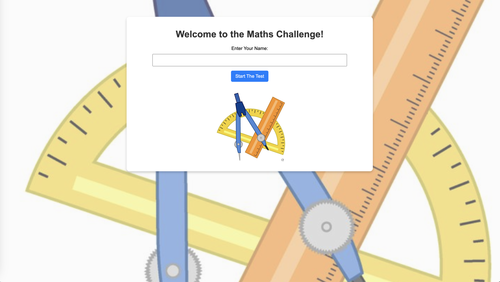
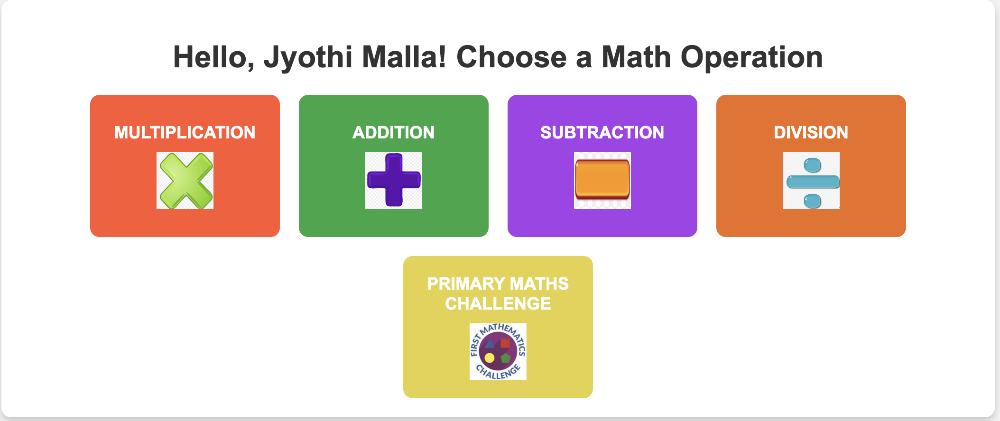
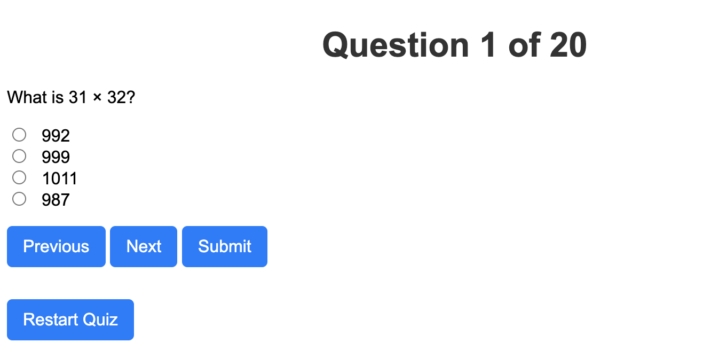

🧮 Mathematics Quiz Challenge – A Web-Based Interactive Quiz Application
📌 About the Project
The Mathematics Quiz Challenge is a web-based quiz application designed to test and enhance users’ mathematical problem-solving skills in an interactive and engaging way. Built using Flask and PostgreSQL, this quiz dynamically generates questions, allowing users to choose different mathematical operations and track their progress over time.

Key Features
✅ Dynamic Question Generation – Math questions (addition, subtraction, multiplication, and division) are generated randomly.
✅ Primary Mathematics Challenge (FMC) Mode – Users can attempt structured fixed questions sourced from a PDF-converted JSON file.
✅ User-Based Quiz Attempts – Users enter their names before starting, and their scores are recorded for each attempt.
✅ Smart Question Selection – The quiz ensures variety in repeated attempts by modifying existing questions.
✅ Web-Based Interface – A fully responsive UI, with support for image-based questions.
✅ Time-Based Quiz – Users are given a limited time to complete the quiz.
✅ Leaderboard System – Scores are stored and displayed on a leaderboard for motivation and competition.
✅ Local Database Storage – User details, quiz attempts, and scores are securely stored in PostgreSQL.

The Mathematics Quiz Challenge is an ideal platform for students and learners to practice and refine their problem-solving skills while keeping track of their progress over time.

🚀 Features

🎯 20 Fixed Questions: Questions appear in a structured order based on difficulty.

🔄 Previous & Next Navigation: Users can move between questions while saving responses.

✅ Submit Button: A final submission option is provided at the end of the quiz.

🏆 Leaderboard & Score Tracking: Scores are saved after each attempt, allowing users to compare progress over multiple sessions.

📄 Web-Based Interface: Fully responsive and user-friendly design.

🕰 Timed Quiz (Upcoming): Future enhancements will include time-based assessments.

🖼 Image-Based Questions (Upcoming): Support for graphical problems.

🆕 New Features Added recently

🔹 FMC Mode (Primary Mathematics Challenge) – Users can now attempt fixed structured math challenges from a PDF-based question set converted into JSON.
🔹 Dynamic Question Generation – Users can select operations (Addition, Subtraction, Multiplication, Division) and get randomly generated math questions.
🔹 Improved UI for Operation Selection – A new interface allows users to choose a quiz type before starting.
🔹 Auto-Changing Background with Blurred Effect – A dynamic background now changes every 10 seconds, providing an engaging user experience.
🔹 Better Navigation System – Users can go back, move forward, or restart the quiz at any time.
🔹 Retake Quiz Button – A new "Retake Quiz" button is available on the home page.

🎯 Core Features
🔹 Choose from Multiple Math Operations – Select Addition, Subtraction, Multiplication, Division, or FMC mode.
🔹 20 Fixed FMC Questions – Predefined structured questions for primary mathematics challenge.
🔹 Previous & Next Navigation – Users can navigate between questions while saving responses.
🔹 Submit Button – A final submission option is available at the end of the quiz.
🔹 Leaderboard & Score Tracking – Scores are saved after each attempt, allowing users to compare progress.
🔹 Web-Based Interface – Fully responsive and user-friendly design.

🕰 Future Enhancements
🟢 Timed Quiz (Upcoming) – Time-based assessments for an extra challenge.
🟢 More Image-Based Questions – Enhance graphical problem-solving.
🟢 User Authentication – Allowing users to log in and track their quiz history.

🛠️ Installation & Setup

1️⃣ Prerequisites

Ensure you have the following installed:

Python 3.x

Flask (pip install flask)

PostgreSQL (using a database for storing results)

2️⃣ Clone the Repository

git clone https://github.com/jyothimalla/MathematicsChallenges.git
cd MathematicsChallenges

3️⃣ Install Dependencies

pip install -r requirements.txt

4️⃣ Run the Flask Server

python app.py

The server will start on http://127.0.0.1:5000

5️⃣ Deploying Online

Use Render for hosting both Flask and PostgreSQL databases.

Alternatively, use Heroku or Railway.app.

🖥️ Usage
1️⃣ Start the Quiz:
🔹 Enter your name and choose a math operation (Addition, Subtraction, Multiplication, Division, or FMC).
🔹 Click Start to begin the test.

2️⃣ Answer the Questions:
🔹 Use the Previous and Next buttons to navigate.
🔹 Select an answer and click Submit at the end.

3️⃣ View Results & Leaderboard:
🔹 After submitting, see your score and track attempts on the leaderboard.
🔹 Click Retake Quiz to restart and try a new operation.

📸 Screenshots

## 📸 Screenshots

### Home Page

### Quiz Interface

### Results

### Leaderboard

📅 Future Improvements

Implement time-based quiz sections.

Add image-based questions.

Improve UI for a better user experience.

Enable user authentication for personalized test tracking.

🏗 Technologies Used

Backend: Flask (Python)

Frontend: HTML, CSS, JavaScript

Database: PostgreSQL (on Render)

Hosting: Render / Heroku (for production)

🤝 Contributing

Contributions are welcome! Please fork the repo and submit a PR with your improvements.

📜 License

This project is open-source and available under the MIT License.

🌟 Made with ❤️ by Jyothi Malla